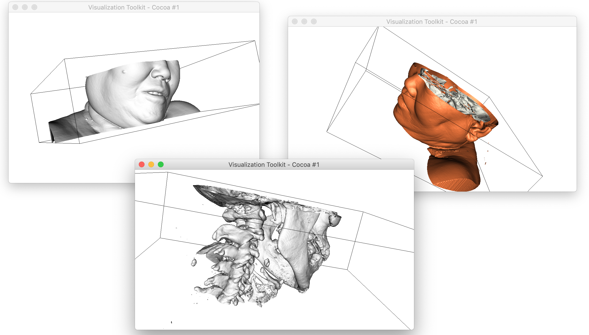
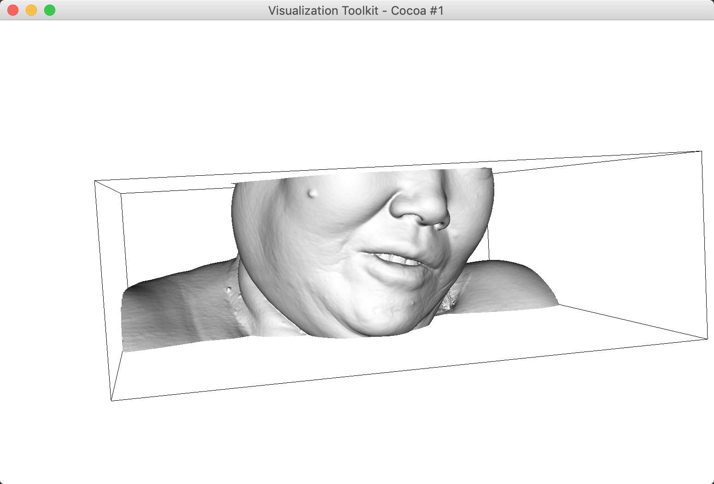
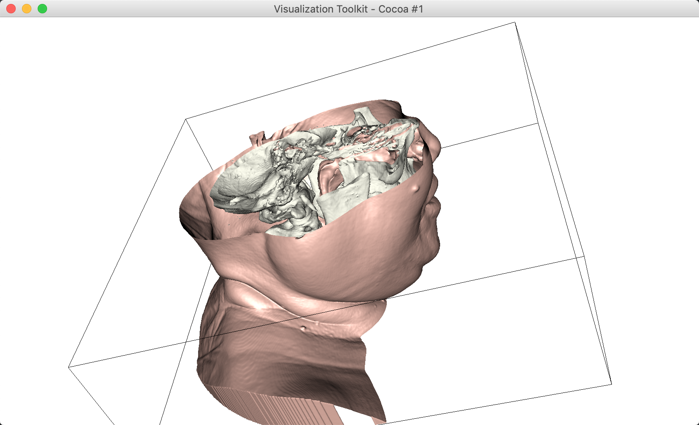

# Medical-Image-3D-Reconstruction

打开一套DICOM格式的医学图片，根据分辨率和层厚做插值，
根据像素大小和层厚调整正确显示比例，确保各个方向分辨率相同，
通过阈值生成骨头边界，进行立体显示，可以进行旋转缩放等操作。
语言不限， IDL , mathlab, openCV等其他语言！

##### Demo

##### Configuration

- `parameter_config.py`: 修改dcm文件路径（绝对路径）

##### OS Platform

- MacOS Mojave
- Ubuntu 16.04

##### Dependency

> run `pip install -r requirement.txt`

- python3
- vtk
- pydicom

##### Usage 

- view bone model: to run `python vtk_bone.py`
  
 
- view skin model: to run `python vtk_skin.py`
  
  
- view bone && skin model: to run `python vtk_bone_skin.py`
  

